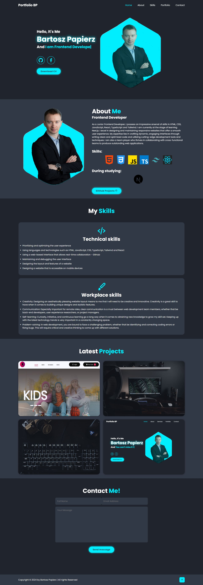

<h2>About the project</h2>

  
A <b>Portfolio</b> Website showing my personality, skills and my projects using
                        such technologies as: HTML, CSS and JavaScript.

👉 Live Demo: <a href='https://ecommerce-shop4u.netlify.app/'>Live Demo</a>

<h3>Build with:</h3>

» HTML  
» CSS  
» JavaScript

<h3>Getting Started:</h3>

» Clone the Ecommerce repository using git: https://github.com/pope881/Portfolio.git  
» Run the application with Live Server 

<h2>Screenshots of the Project 📸</h2>
 
<h3 align='center'>Home Page 🏡</h3>

